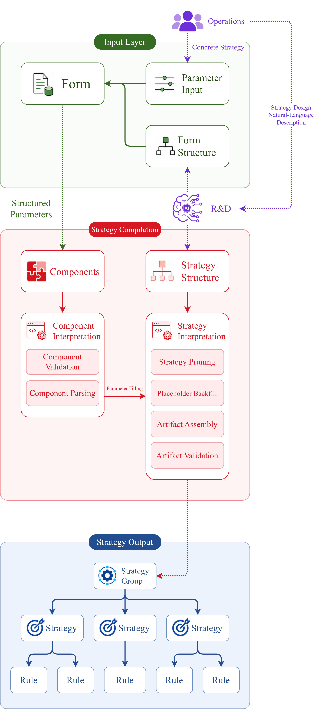
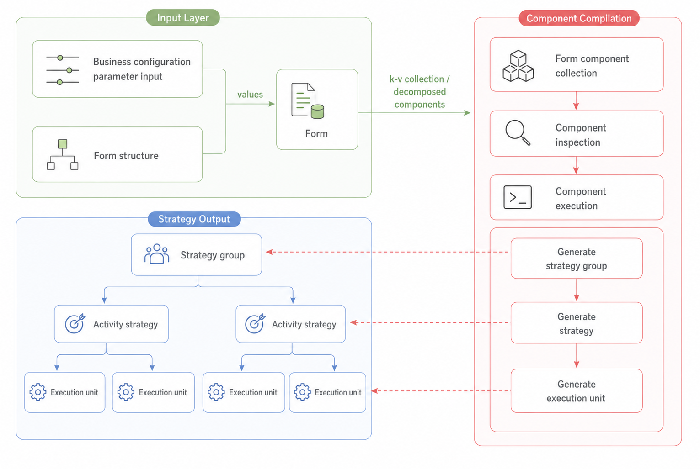

# Strategy System

## Strategy

**Strategy is the structured expression of business intent.** Business intent refers to the outcome that operators want to achieve, but at the outset this intent is often vague, abstract, and shaped by subjective judgment. The role of strategy is to break that intent down into a clear logical structure so that the system can understand it and drive execution.

### Strategy Rule

#### Strategy Object

### Strategy Lifecycle

## Strategy System

A **strategy system** enables a business strategy to evolve from a vague idea into rules that a system can understand, and then run automatically in real business scenarios. The results generated during execution are then used to validate the original business assumptions, drive further strategy adjustments, and ultimately establish a closed-loop mechanism across the strategy lifecycle — one that starts from intent and is calibrated by outcomes. The system consists of four core components:

> **Strategy Production → Decision-Making → Execution → Feedback**

1. **Strategy Production: How business intent is accurately expressed by the system**. Provide a business-readable strategy modeling language that transforms vague and abstract business ideas into strategy expressions that the system can understand and execute. The system must be able to adapt to frequent changes in business marketing strategies and manage the full lifecycle of each strategy.

2. **Strategy Decision-Making: Deciding the most appropriate strategy**. Match the right person with the right strategy. Based on object characteristics and business rules, the system determines which strategies should be triggered. This prevents all business objects from seeing the same content and makes strategies more precise. When multiple strategies are triggered at the same time, coordination mechanisms such as priority and mutual exclusion are used to determine the final strategy result.

3. **Strategy Execution: Ensuring the strategy can actually run**. Turn strategy configurations into real business actions. Strategy rules essentially describe **“at what timing, under what conditions, and what action should be executed.”** Through an event-driven mechanism, the system can understand these rules and automatically evaluate and execute them at the appropriate moment.

4. **Strategy Feedback: Determining whether the strategy is truly effective**. After a strategy goes live, its effectiveness must be validated to determine whether it has actually created business value and whether the original business hypothesis holds true. Through performance attribution and review, the system helps the business decide whether a strategy should be continued, adjusted, or taken offline.

## Strategy Production System

Many strategy actions are not fixed. Instead, they are continuously adjusted based on factors such as campaign objectives, audience characteristics, trigger timing, promotion rules, and engagement channels. To enable operators to configure these rules flexibly while ensuring that the system can execute them stably and accurately, strategy needs to be abstracted from code logic and uniformly expressed, managed, and compiled through a production service.

A **strategy production service** is a system capability used to carry, manage, and generate  strategies. It serves as an intermediate layer connecting business expression and technical execution. Through rule interpretation and compilation mechanisms, it transforms marketing strategy descriptions that operations personnel can understand into executable strategy instances that technical systems can run.

From an operations perspective, the input provided by the operations side mainly falls into two categories:

1. Structured business parameter configuration, usually presented in the form of a form, and mainly used to generate different concrete marketing campaigns. Examples include specific values such as campaign time, target cities, coupon batches, budget, and frequency control.

2. A marketing campaign plan described more in natural language, which serves as a reusable business strategy template. It is used to describe the business objective, campaign process, trigger logic, and related business rules.

### Form-based strategy production 

> *Standardization is the prerequisite for AI intelligence. Only when the system’s capability boundaries, parameter rules, and artifact structures are clearly defined can AI move from natural-language understanding to executable engineering productivity, rather than remaining at the level of uncontrollable text generation or experience-based suggestions.*

The entire process can be summarized as follows: operators complete parameter configuration through forms. Based on the form structure and component definitions, the system parses, validates, and compiles these configuration contents into runtime strategy objects.

In this process, the form is responsible for expressing and carrying configuration. It organizes the parameters filled in by operators into structured configurations. Components are responsible for converting configuration into strategies. They parse, validate, and compile local configurations within the form. Strategy output refers to the set of objects that the system can actually recognize and execute at runtime.

1. **Input Layer**: Operators fill in parameters. The form structure defines how the parameters are organized, their hierarchical relationships, and constraint rules, ultimately forming a complete form configuration.
2. **Component Compilation Layer**: The system parses the form into a key-value collection and maps it to corresponding component instances based on component definitions. Components inspect, parse, and compile the configuration content, generating the corresponding strategy fragments.
3. **Strategy Output Layer**: After component compilation, the system generates runtime objects such as strategy groups, activity strategies, and execution units, transforming the original configuration into strategy output that can be scheduled, executed, and managed by the system.

---

This architecture can be divided into three layers: the input layer, the strategy compilation layer, and the strategy output layer. Together, these three layers form a progressive transformation process from **business semantics** to **structured parameters**, and then to **executable strategy artifacts**.

1. **Input Layer: How business requirements are expressed and structured**. The input layer serves collaboration between operations and Product, R&D, and Testing. It is responsible for requirement expression, business parameter input, and form structure generation. The input layer addresses the questions of **“what the business wants to do”** and **“what parameters are needed to express these business intents.”** Its output must be structured enough to enter the compilation pipeline, while also staying close enough to business language for operations to understand and confirm.

2. **Strategy Compilation Layer: How structured requirements are deterministically assembled into strategy artifacts**. The strategy compilation layer faces the internal system and is responsible for combining form parameters and strategy structures in a deterministic manner. Without a strategy structure, form parameters are merely isolated data. Without parameter backfilling, the strategy structure is merely an abstract template. Through parameter binding relationships, the compilation layer integrates the two into concrete strategy artifacts.
   1. **Parameter component interpretation:** The form structure generated by the input layer and the business parameters filled in by operations cannot directly enter the strategy artifact. Parameter component interpretation needs to complete two types of work. First, component validation confirms whether the input values meet the type, range, mandatory-field, and business-constraint requirements defined by the component. Second, component parsing converts business-friendly input values into internal parameters that the strategy system can consume. Through this process, operational inputs are transformed from **business parameters** into **system parameters**.
   2. **Strategy structure interpretation:** Based on the structured intent and actual parameters, strategy structure interpretation converts the logical skeleton into a concrete, assemblable artifact model. Strategy pruning is used to remove template branches that are not needed for the current requirement. Placeholder backfilling is used to fill the values parsed by parameter components into conditions, actions, and canvas configurations. Artifact assembly is used to generate internal objects such as strategy groups, strategies, and rules. Artifact validation is then used to confirm whether the structure is complete, references exist, parameters are sufficient, and expressions can be interpreted.

3. **Strategy Output Layer: Whether the strategy artifact can run safely**. The strategy output layer faces the final execution result. It receives executable objects such as strategy groups, strategies, and rules, and supports capabilities such as structural validation, business verification, and sandbox pre-runs for strategy artifacts. It both accepts compilation results and takes responsibility for final execution. It performs integrity checks at the structural level as well as reasonableness checks at the business level. It supports both static validation and sandbox pre-runs with behavioral verification. Only strategy groups, strategies, and rules that have passed validation in the output layer should enter the release process or the online execution environment.

**Core Concepts in the Architecture Diagram**

**(1) The purple flow represents the core of strategy production.**
Operations first describe specific strategy requirements in natural language and then complete the required business parameters after the form is generated. Although the requirement description is complete from a business perspective, it remains unstructured from a system perspective.

The purple section in the diagram, R&D plays the key role of structuring natural language so that the requirement can enter the strategy platform. It receives the natural-language requirements from operations, combines them with the existing system capability library — including triggers, conditions, attributes, actions, and form component capabilities — performs semantic parsing and capability matching, and generates two core outputs:

1. A form structure for operations to supplement business parameters.

2. A strategy structure for subsequent compilation.

The key design point here is that the form structure and the strategy structure must be generated from the same source. In other words, the system should not first generate an isolated form and then have R&D separately write a strategy template. Instead, both should originate from the same structured intent. Only in this way can the business parameters filled in by operations in the form be accurately mapped back to the corresponding conditions, actions, and rule nodes during the strategy compilation stage.

**(2) Form.**
In this architecture, the form serves as the business parameter view. It is the external representation of the configurable parts of a strategy. Operations use the form to fill in parameters such as campaign name, start and end time, and city scope. After being structured, these parameters flow downward into the parameter component system.

The parameter components are responsible for component-level validation and parsing of form fields, ensuring that the input values comply with requirements around type, range, mandatory fields, and business constraints. In this way, the form layer transforms variable business elements expressed in operational language into structured parameters that the system can consume. The form includes:

1. **Form structure:** Used to aggregate components and define their organization, hierarchy, and relationships, thereby providing structural constraints for form generation. This is typically represented as a Schema, such as JSON.

2. **Business parameter input:** The concrete parameter values provided by business users to describe a specific business strategy when producing a particular campaign strategy.

**(3) Parameter components.**
Parameter components are the intermediate abstraction that connects **“business inputs understandable to operations”** with **“executable parameters understandable to the strategy engine.”** Front-end form controls — such as input boxes, dropdown menus, or selectors on the page — are only the external representation of parameter components.

A parameter component is a structured configuration unit that contains business semantics, data constraints, parsing rules, and binding paths. On one hand, it determines how operations fill in business parameters in the form. On the other hand, it determines how these parameters are validated, parsed, and mapped back into the strategy structure. Therefore, parameter components are the key bridge between the form layer and the strategy compilation layer.

**(4) Strategy structure.**
The strategy structure is the logical skeleton of the executable strategy artifact. It contains the strategy execution logic itself, as well as the internal topological relationships within the strategy artifact. It is the strategy skeleton jointly generated by Product, R&D, and Testing based on requirements, the capability library, and template rules.

After this skeleton enters the strategy compilation layer, it goes through a strategy interpretation process to generate the final strategy artifact. Therefore, the strategy structure connects upward to natural-language requirements and structured intent, and connects downward to strategy interpretation and final artifact generation.

It both describes business logic and constrains parameter mapping. It serves both R&D review and compilation execution. Without the strategy structure, form parameters cannot be converted into execution logic. Without interpretation of the strategy structure, a strategy draft cannot become a strategy group, strategy, or rule that the system can actually run.

**(5) System capability library.**
Natural language models have strong semantic understanding capabilities, but they do not inherently know which triggers, conditions, attributes, and actions actually exist in the current system. Without the constraints of a capability library, the model may generate configurations that are semantically reasonable but not executable by the system.

Therefore, when AI generates the form structure and strategy structure, it must be constrained by the existing capabilities of system. It can only select candidate capabilities from existing triggers, conditions, attributes, and actions. For requirements that cannot be matched, it should output missing capabilities or items requiring confirmation, rather than inventing system objects that do not exist.

In this way, the system can leverage model capabilities while controlling the risk of hallucination. At the same time, AI supports the process-driven production of new system capability elements, enabling more complex strategy solutions that go beyond the current capability set.

#### Component: The Minimum Compilable Unit of Strategy Configuration

A component is the smallest compilable unit of strategy configuration and the core bridge between “form configuration” and “strategy output.” It transforms form fields that operators can understand and configure into strategy objects that the system can parse, schedule, and execute. It is both a configuration unit within the form and a compilation unit in the strategy generation process.

- **On the form side**, a component appears as a configurable control, such as an audience selector, time configurator, coupon configurator, or engagement channel configurator. Operators fill in specific parameters through these components to express local logic.

- **On the compilation side**, a component is not merely a frontend control, but a strategy unit with business semantics and compilation capability. It can read key-value configurations from the form, validate their legality, parse their structure, perform semantic transformation, and compile them into strategy fragments that the system can recognize. Each component is responsible for generating part of the strategy. Multiple components collaborate according to the form structure and are compiled together to eventually form a complete executable strategy.

### Canvas-based strategy production

## Strategy Execute System

## Strategy Evaluate System

## Strategy Reach System

